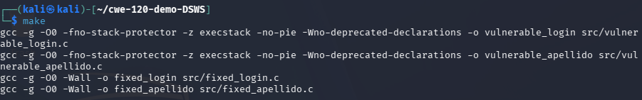
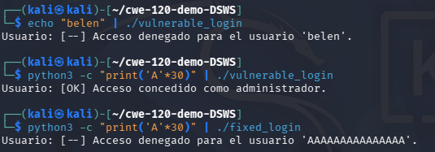
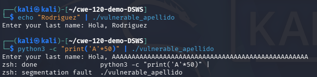
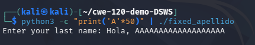
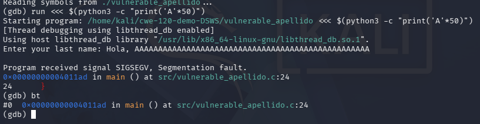

<!-- ============================================================ -->
<!-- CARÁTULA -->
<!-- ============================================================ -->

<div align="center">

# Universidad Católica del Uruguay

### Desarrollo de Software Seguro

# Writeup — Demo CWE-120: Buffer Copy without Checking Size of Input ('Classic Buffer Overflow')


**Belén Kanas** 

**Desarrollo de Software Seguro** 

**Profesores:** 

Wiler Alvez

Nicolás Piquerez

Alejandro Piccardo

Leonardo Conde

**27 de agosto de 2026**

----------
</div>


<div style="page-break-after: always;"></div>


## Introducción

CWE-120 describe una de las fallas de seguridad más antiguas y persistentes en
software escrito en C/C++: copiar datos de entrada a un buffer de tamaño fijo
sin verificar que esos datos entren en el espacio reservado. El caso más
conocido en la vida real es el **gusano Morris (1988)**, que explotó
exactamente este patrón en el demonio `fingerd` de BSD Unix.

Este writeup documenta cómo levantar y ejecutar, en una VM de **Kali Linux**,
la demo práctica que acompaña la presentación del curso. La demo reproduce en
un entorno controlado los dos escenarios típicos de esta debilidad:

1. Un desbordamiento que **corrompe una variable vecina** en el stack y altera
   el flujo de un programa (bypass de un control de acceso).
2. Un desbordamiento que **corrompe memoria fuera de control** y termina en un
   `Segmentation fault` (impacto de Disponibilidad / DoS).

Para cada escenario se incluye además la versión **corregida**, de forma que
se pueda comparar el comportamiento antes y después de aplicar la mitigación.

## Objetivo

- Clonar y compilar el repositorio de la demo en una VM de Kali Linux.
- Ejecutar los dos escenarios vulnerables y observar el impacto real de
  CWE-120 (bypass de lógica y crash por corrupción de memoria).
- Ejecutar las versiones corregidas para verificar que el mismo input ya no
  produce el mismo efecto.
- (Opcional) Inspeccionar con `gdb` cómo se corrompe la memoria, para reforzar el concepto a nivel de stack.

> `gdb` (GNU Debugger) es el depurador estándar en Linux para programas en
  > C/C++. Permite ejecutar un binario paso a paso, inspeccionar variables y
  > memoria en tiempo real, y ver el estado del stack en el momento exacto de
  > una falla. En esta demo lo usamos para confirmar *por qué* crashea el
  > programa (memoria corrupta), en vez de quedarnos solo con el mensaje de
  > `Segmentation fault`.

## Requisitos previos

- Una VM de **Kali Linux** (2023.x o superior) con conexión a internet.
- `git`, `gcc` y `make` instalados. Kali los trae por defecto, pero conviene
  verificarlo:

```bash
git --version
gcc --version
make --version
```

Si falta alguno, se instalan con:

```bash
sudo apt update
sudo apt install -y git build-essential gdb
```

## Paso 1 — Clonar el repositorio desde la VM

Abrir una terminal en Kali y ejecutar:

```bash
cd ~
git https://github.com/belenkanas/cwe-120-demo-DSWS.git
cd cwe-120-demo-DSWS
```

Verificar que se haya clonado correctamente:

```bash
ls -la
```

Se debería ver `Makefile`, `README.md`, `.gitignore` y la carpeta `src/` con los cuatro archivos `.c` (además de que se agrega la carpeta `images/` -imágenes correspondientes al writeup actual-).

## Paso 2 — Compilar los binarios

El `Makefile` genera 4 binarios: dos vulnerables y dos corregidos. Las flags de compilación de los binarios vulnerables **desactivan a propósito** protecciones del compilador (stack protector, NX, PIE) para poder observar el comportamiento "clásico" de CWE-120. Esto está comentado explícitamente en el
`Makefile` y es solo para fines educativos, como el de esta demo.

```bash
make
```

Salida esperada:

```
gcc -g -O0 -fno-stack-protector -z execstack -no-pie -Wno-deprecated-declarations -o vulnerable_login src/vulnerable_login.c
gcc -g -O0 -fno-stack-protector -z execstack -no-pie -Wno-deprecated-declarations -o vulnerable_apellido src/vulnerable_apellido.c
gcc -g -O0 -Wall -o fixed_login src/fixed_login.c
gcc -g -O0 -Wall -o fixed_apellido src/fixed_apellido.c
```


## Paso 3 — Demo 1: bypass de un login por overflow

`vulnerable_login.c` tiene un buffer `usuario[16]` seguido de un flag `acceso_admin` (inicializado en `0`). Si la entrada supera el tamaño del 
buffer, sigue escribiendo en la memoria contigua y puede alterar ese flag.

**Caso normal (sin overflow):**

```bash
echo "belen" | ./vulnerable_login
```

Salida esperada:

```
Usuario: [--] Acceso denegado para el usuario 'belen'.
```

**Caso con overflow (30 caracteres):**

```bash
python3 -c "print('A'*30)" | ./vulnerable_login
```

Salida esperada:

```
Usuario: [OK] Acceso concedido como administrador.
```

Sin ingresar ninguna contraseña, el desbordamiento "pisó" `acceso_admin` y
cambió el resultado del `if`. (Con 40 caracteres o más, el programa
directamente crashea con `Segmentation fault` — 30 es el punto justo que
pisa la variable sin corromper nada más.)

**Ahora la versión corregida, con el mismo input:**

```bash
python3 -c "print('A'*30)" | ./fixed_login
```

Salida esperada:

```
Usuario: [--] Acceso denegado para el usuario 'AAAAAAAAAAAAAAA'.
```

`fgets()` trunca la entrada al tamaño real del buffer, por lo que
`acceso_admin` nunca se ve afectado.

Resumen:



## Paso 4 — Demo 2: el ejemplo oficial de CWE-120 (crash)

`vulnerable_apellido.c` reproduce el código exacto de la definición de
CWE-120 (`char last_name[20]` + `scanf("%s", last_name)`).

**Caso normal:**

```bash
echo "Rodriguez" | ./vulnerable_apellido
```

Salida esperada:

```
Enter your last name: Hola, Rodriguez
```

**Caso con overflow (50 caracteres):**

```bash
python3 -c "print('A'*50)" | ./vulnerable_apellido
```

Salida esperada:

```
Enter your last name: Segmentation fault
```

El programa corrompe memoria más allá del buffer y termina abruptamente el impacto de **Disponibilidad (DoS)** que se menciona en la presentación.



**Versión corregida:**

```bash
python3 -c "print('A'*50)" | ./fixed_apellido
```

Salida esperada:

```
Enter your last name: Hola, AAAAAAAAAAAAAAAAAAA
```
Diferencia:



Con `scanf("%19s", last_name)` la entrada se trunca de forma segura y el
programa no crashea.

## Paso 5 (opcional) — Ver la corrupción de memoria con gdb

Para reforzar el "por qué" del crash, se puede inspeccionar con `gdb`:

```bash
gdb ./vulnerable_apellido
```

Dentro de gdb:

```
(gdb) run <<< $(python3 -c "print('A'*50)")
(gdb) bt
```


El `backtrace` (`bt`) va a mostrar una dirección de retorno corrupta o
inválida, evidenciando que la memoria contigua al buffer (en este caso, hacia
el stack frame de `main`) fue sobrescrita por la entrada del usuario.

Para salir de gdb:

```
(gdb) quit
```

## Paso 6 — Limpiar los binarios (opcional)

Una vez terminada la demo, se pueden borrar los binarios compilados (quedan
excluidos del repo por el `.gitignore`):

```bash
make clean
```

## Resumen de comandos (referencia rápida)

```bash
# Clonar
git https://github.com/belenkanas/cwe-120-demo-DSWS.git
cd cwe-120-demo-DSWS

# Compilar
make

# Demo 1 — bypass de login
echo "belen" | ./vulnerable_login
python3 -c "print('A'*30)" | ./vulnerable_login
python3 -c "print('A'*30)" | ./fixed_login

# Demo 2 — crash
echo "Rodriguez" | ./vulnerable_apellido
python3 -c "print('A'*50)" | ./vulnerable_apellido
python3 -c "print('A'*50)" | ./fixed_apellido

# Limpiar
make clean
```

## Conclusión

Esta demo permite ver, en dos escenarios distintos y con muy poco código,
por qué CWE-120 sigue en el Top 25 de CWE/SANS después de más de 35 años de
conocida:

- **No es necesario "hackear" nada sofisticado** para explotarla: alcanza con
  una entrada más larga de lo esperado y una función que copie datos sin
  verificar su tamaño (`gets`, `scanf("%s", ...)`, `strcpy`, entre otras).
- El impacto puede ir desde **alterar la lógica del programa** (Demo 1, similar
  en espíritu a cómo el gusano Morris obtuvo una shell) hasta **negar el
  servicio** por un crash (Demo 2).
- La mitigación es simple y de bajo costo: usar funciones que reciban el
  tamaño del buffer como parámetro (`fgets`, `strncpy`, ancho fijo en
  `scanf`) y validar siempre la entrada externa antes de copiarla.

El hecho de que el mismo patrón haya aparecido en el gusano Morris (1988), en
WhatsApp (CVE-2019-3568, 2019) y en Erlang/OTP (2026) confirma que CWE-120 no
es un problema histórico: es un error de implementación que sigue
apareciendo cada vez que no se aplican estas prácticas básicas de
validación de entrada.